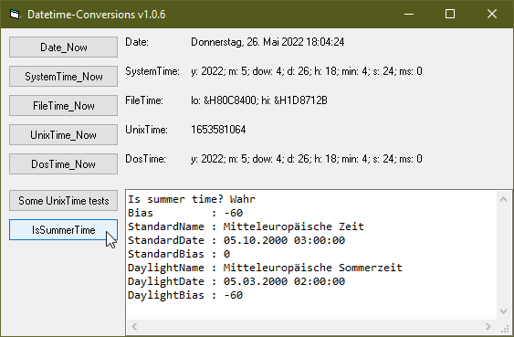

# Date_TimeConversion  
## Converts between Date, SystemTime, FileTime, UnixTime, DosTime, WindowsFoundationDateTime  

 

the project to collect all those function together in one module started in jan.2021  
The functions itself were spread all over different codes, starting in about y 2000.  

